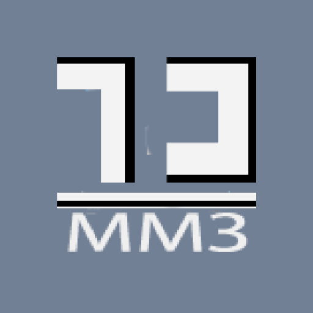
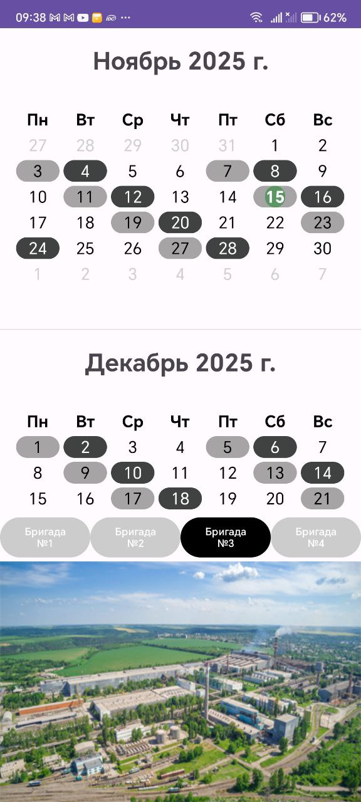
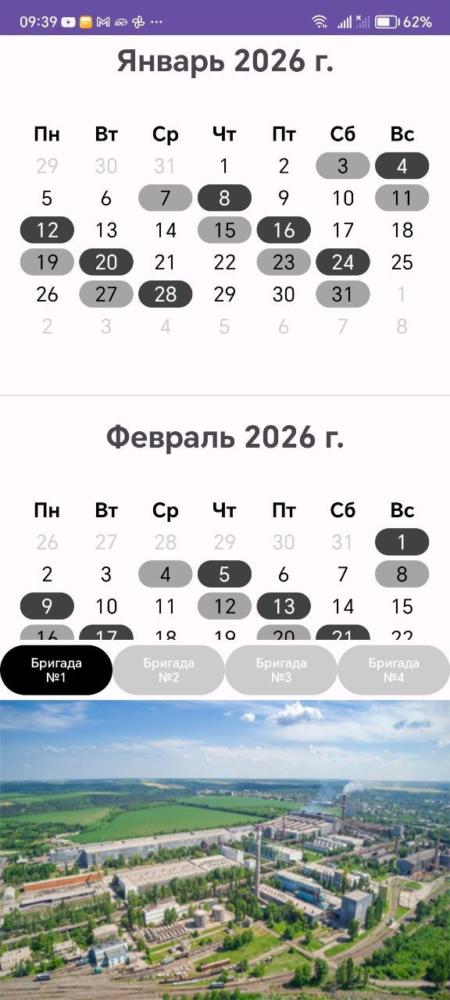

  

# Shift Scheduler

Shift Scheduler is an Android application designed for workers at a metal factory with a four-shift schedule.  

Users can select their brigade, and the calendar highlights each day in different colors to show day shift, night shift, rest day, or off day.  

This app makes it easy to see your work schedule at a glance and plan your days efficiently.

---

## ✨ Features

- Select your brigade/team  
- Four-shift schedule tracking  
- Color-coded calendar:  
  - Day shift  
  - Night shift  
  - Rest day  
  - Off day  
- Quick overview of any date  
- Simple and intuitive neon-style UI

---

## 📷 Screenshots

  
  

---

## 🛠 Technologies Used

- Kotlin
- Android Studio
- RecyclerView + Adapters
- Custom Neon UI
- System time (no Firebase required)
- XML Layout

---

## 🚀 How It Works

1. Launch the app  
2. Tap Add Event  
3. Enter a name for your event  
4. The timer starts immediately  
5. Check how long it has been since your milestone  
6. Manage and remove events whenever needed  

---
